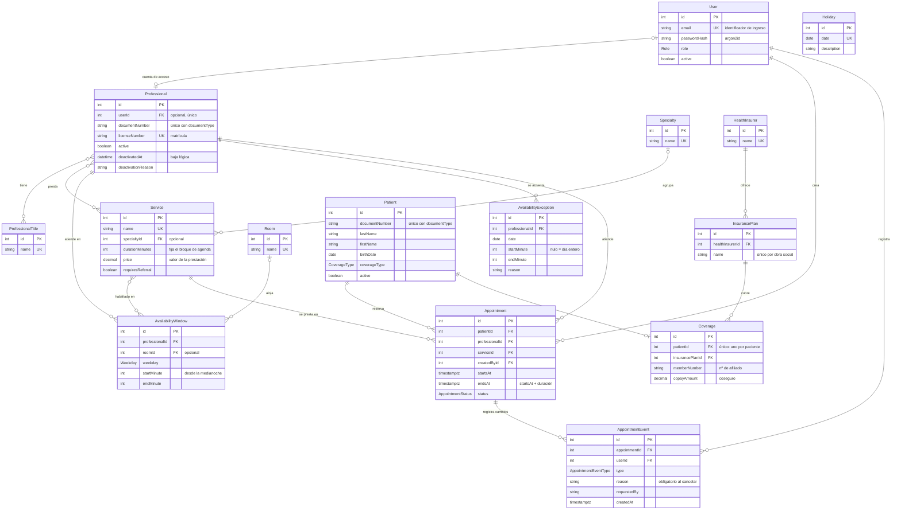

# Modelo de datos (DER)

Diagrama entidad-relación del schema del **Incremento 1**. La fuente de verdad es [`prisma/schema.prisma`](../prisma/schema.prisma) y la migración a mano de `prisma/migrations/`: este documento es un mapa para entenderlas, no las reemplaza. Si discrepan, gana el schema y se corrige este documento.

Los nombres son los de [`glossary.md`](glossary.md). El diagrama muestra claves y los campos que definen a cada entidad; la lista completa de campos está en el schema.

## Diagrama

**Cómo leerlo.** `||` es "uno y solo uno", `|o` es "cero o uno", `o{` es "cero o muchos". `PK` es clave primaria, `FK` clave foránea y `UK` valor único. `Holiday` no se relaciona con ninguna entidad: el centro cierra ese día para todos y la DAL lo consulta por fecha.

## Grupos de entidades

| Grupo | Entidades | Qué resuelve |
|---|---|---|
| Acceso | `User` | Cuenta, rol y credencial (HU-01). Se ingresa con email y contraseña; la sesión no se persiste ([ADR 0002](adr/0002-autenticacion-y-sesion.md)). |
| Profesionales | `Professional`, `ProfessionalTitle` | Ficha del profesional y sus títulos (HU-02 a HU-04). |
| Catálogo | `Service`, `Specialty` | Qué se hace en un turno, cuánto dura y cuánto vale (HU-06). |
| Agenda | `AvailabilityWindow`, `AvailabilityException`, `Holiday`, `Room` | Cuándo y dónde atiende cada profesional, y cuándo el centro no atiende (HU-05). |
| Pacientes y cobertura | `Patient`, `Coverage`, `InsurancePlan`, `HealthInsurer` | Quién es el paciente y cómo se cubre (HU-07, HU-08). |
| Turnos | `Appointment`, `AppointmentEvent` | La reserva y su traza de cambios (HU-09, HU-10; se consultan en HU-11 y HU-12). |

## Relaciones que conviene explicar

- **`User` – `Professional` es opcional y 1 a 1.** No todo usuario atiende (mesa de entradas, gerente) y no todo profesional necesita cuenta. Cuando la tiene, es la que usa en HU-12 para ver su agenda.
- **`Coverage` solo existe con obra social.** Un `Patient` con `coverageType = PRIVATE` no tiene `Coverage`; con `HEALTH_INSURANCE` tiene exactamente una. Que las dos cosas coincidan lo debe verificar la DAL, no la base.
- **Valor, cobertura y pago están en entidades distintas.** El valor de la prestación vive en `Service.price` y el coseguro en `Coverage.copayAmount`. `Appointment` no guarda importes. Lo que efectivamente paga el paciente se modela con `Payment`, que todavía no existe (ver más abajo).
- **Las relaciones muchos a muchos** las resuelve Prisma con tablas implícitas: `_ProfessionalToProfessionalTitle`, `_ProfessionalToService` y `_AvailabilityWindowToService`. No tienen atributos propios, por eso no aparecen como entidades. Una `AvailabilityWindow` sin servicios asignados habilita todos los que presta el profesional.
- **`Appointment` no tiene relación con la franja ni con el consultorio.** Que el turno caiga dentro de una `AvailabilityWindow` se verifica al crearlo, con la disponibilidad vigente; el turno guarda solo su `startsAt` y `endsAt`.
- **Auditoría.** Para no llenar el diagrama de flechas, solo se dibujaron las relaciones de `User` con `Appointment` y `AppointmentEvent`. El resto de las referencias a `User` son campos de autoría: `createdById` en `Professional`, `Patient` y `AvailabilityException`; `updatedById` en `Professional` y `Patient`; y `deactivatedById` en `Professional`.
- **Trazabilidad del turno.** El alta se registra en `Appointment.createdById` y `createdAt`. Todo cambio posterior (`UPDATED`, `CANCELLED`, `COMPLETED`, `EXPIRED`) agrega un `AppointmentEvent` con quién, cuándo, tipo y motivo. Los eventos se borran en cascada con el turno, pero un turno cancelado no se borra (HU-10).
- **Bajas lógicas.** Se usa `active` (más `deactivatedAt` en `Professional`) y nunca se borra el registro, para no perder la historia de los turnos.

## Reglas que garantiza la base de datos

Prisma no las declara, así que están escritas a mano en la migración `prisma/migrations/20260921194607_modelo_inicial/migration.sql`. Son la garantía real de la regla "no hay turnos superpuestos": se cumplen aunque dos usuarios reserven a la vez (ver [ADR 0001](adr/0001-server-actions-y-capa-de-acceso-a-datos.md), "Concurrencia en turnos").

| Restricción | Regla |
|---|---|
| `Appointment_professional_no_overlap` | Un profesional no puede tener dos turnos cuyos intervalos se pisen. Cuentan los turnos `SCHEDULED` y `COMPLETED`; los cancelados y vencidos liberan el horario. |
| `Appointment_patient_no_overlap` | Lo mismo para un paciente (HU-09). |
| `Appointment_ends_after_start` | `endsAt` es posterior a `startsAt`. |
| `AvailabilityWindow_no_overlap` | Un profesional no puede tener dos franjas que se pisen el mismo día (HU-05). |
| `AvailabilityWindow_minutes_valid` | La franja va de 0 a 1440 minutos y empieza antes de terminar. |
| `AvailabilityException_minutes_valid` | Los dos minutos de una excepción van juntos: ambos nulos significa el día entero. |
| `Service_duration_positive` | La duración de una prestación es mayor que cero. |
| `Service_price_not_negative` | El valor de una prestación no es negativo. |

También hay unicidad en el email de ingreso (`User.email`), en la identificación de las personas (`documentType` + `documentNumber` en `Patient` y en `Professional`), en la matrícula (`Professional.licenseNumber`), en `Holiday.date`, en el plan dentro de su obra social y en `Coverage.patientId`.

## Reglas que hace cumplir la DAL

No se pueden expresar en el schema: las hace cumplir la DAL (`src/lib/dal/`, todavía por implementar) al construirse cada historia. Ni el diagrama ni la base las garantizan.

- `Appointment.endsAt` se calcula con `startsAt` más `Service.durationMinutes`.
- El turno entra completo dentro de una franja del profesional, y no cae en un feriado ni en una excepción de agenda (HU-05, HU-09).
- Un turno solo cambia de estado desde `SCHEDULED`; los otros tres estados son finales.
- El motivo es obligatorio al cancelar (HU-10).
- `Coverage` existe si y solo si `coverageType` es `HEALTH_INSURANCE`.
- Un usuario inactivo no puede ingresar ni sostener una sesión abierta: `getSession()` relee `active` en cada request ([ADR 0002](adr/0002-autenticacion-y-sesion.md)).
- El formato de la matrícula y el resto de la validación de entrada lo hace Zod en cada acción.

## Todavía no modelado

Están en el glosario pero no en el schema, porque pertenecen a incrementos posteriores: `Encounter` (atención registrada), `Prescription`, `Payment`, `PaymentMethod` y `Overbooking` (sobreturno, pendiente de la pregunta abierta 2 al cliente). Cuando entren, se agregan al diagrama en el mismo cambio.

## Mantenimiento

Es un archivo escrito a mano y se desactualiza si nadie lo toca. **Todo cambio en `schema.prisma` o en las restricciones de la migración actualiza este documento en el mismo Pull Request**: entidades y relaciones en el diagrama, y restricciones en las tablas de reglas.

Para ver el diagrama, abrir este archivo en GitHub o en la vista previa de Markdown del editor (con soporte de Mermaid).
